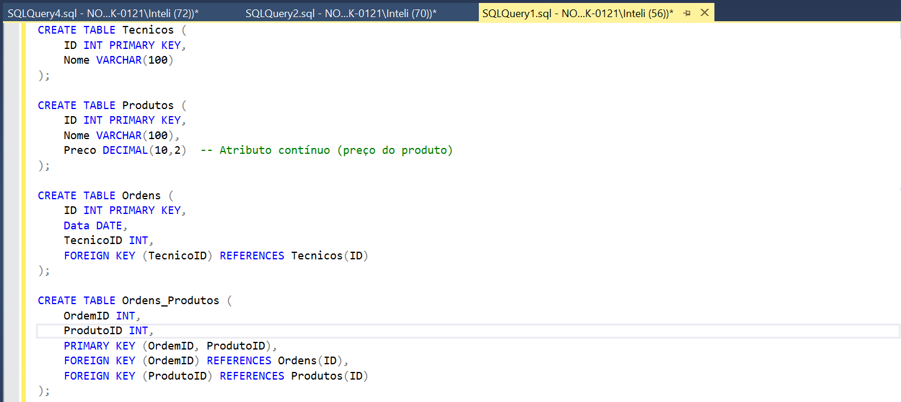
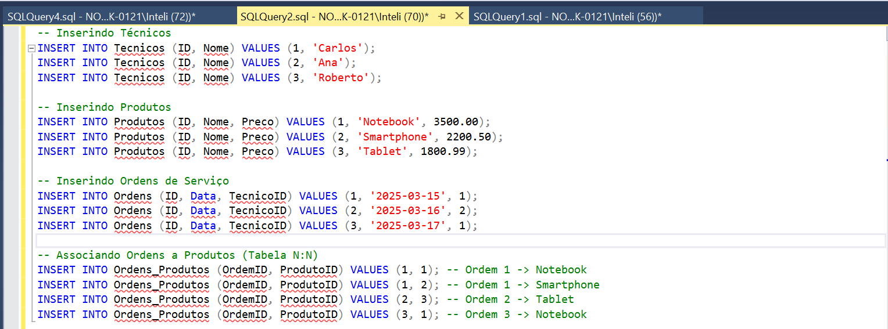
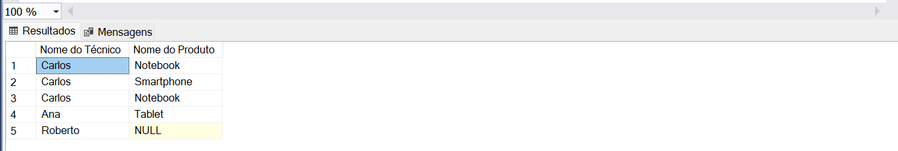

- **Relação 1:N**: Técnicos que consertam produtos eletrônicos.
- **Relação N:N**: Ordens de serviço associadas a produtos.

As tabelas possuem múltiplos atributos, incluindo um atributo não-chave com valor contínuo, como o "preço do produto".

## Estrutura do Banco de Dados

### Tabelas

O banco de dados consiste nas seguintes tabelas:

- **Tecnicos**: Contém informações sobre os técnicos que realizam os reparos.
- **Produtos**: Contém informações sobre os produtos disponíveis para reparo, incluindo preços.
- **Ordens**: Armazena as ordens de serviço associadas aos técnicos.
- **Ordens_Produtos**: Tabela de junção entre **Ordens** e **Produtos**, representando a relação N:N.

#### Definição das Tabelas



#### Inserção de Dados



## Consulta SQL Complexa

### Objetivo da Consulta

A consulta SQL deve revelar as seguintes informações:

- Todos os técnicos e os produtos que eles repararam.
- Técnicos que não têm registros de reparos (ou seja, técnicos sem ordens associadas a produtos).

### Consulta SQL

A consulta SQL abaixo faz uso de três tabelas: **Tecnicos**, **Ordens**, e **Produtos**, além de utilizar tipos diferentes de junção (LEFT JOIN e EXISTS) para alcançar os resultados desejados.

```sql
SELECT 
    T.Nome AS 'Nome do Técnico', 
    P.Nome AS 'Nome do Produto'
FROM Tecnicos T
LEFT JOIN Ordens O ON T.ID = O.TecnicoID
LEFT JOIN Ordens_Produtos OP ON O.ID = OP.OrdemID
LEFT JOIN Produtos P ON OP.ProdutoID = P.ID;
```

### Resultado Esperado



### Explicação da Consulta

- **LEFT JOIN** entre **Tecnicos** e **Ordens**: Garante que todos os técnicos sejam listados, incluindo aqueles sem ordens associadas.
- **LEFT JOIN** entre **Ordens** e **Ordens_Produtos**: Relaciona as ordens com os produtos.
- **LEFT JOIN** entre **Ordens_Produtos** e **Produtos**: Relaciona os produtos que foram reparados em cada ordem.
- **NOT EXISTS**: Verifica os técnicos que não têm produtos associados a suas ordens.

### Equação da Álgebra Relacional

A consulta SQL pode ser expressa na seguinte forma de álgebra relacional:

```plaintext
π T.Nome, P.Nome (
    (Tecnicos ⨝ T.ID = O.TecnicoID Ordens) 
    ⨝ O.ID = OP.OrdemID 
    (Ordens_Produtos ⨝ OP.ProdutoID = P.ID Produtos)
) 
⨝ 
( (Produtos ⨝ P2.ID = OP2.ProdutoID Ordens_Produtos) ⨝ OP2.OrdemID = O.ID Ordens )
```

### Explicação da Álgebra Relacional

- **π T.Nome, P.Nome**: Projeção dos nomes do técnico e do produto.
- **⨝ T.ID = O.TecnicoID**: Junção entre as tabelas **Tecnicos** e **Ordens** usando a chave estrangeira **TecnicoID**.
- **⨝ O.ID = OP.OrdemID**: Junção entre **Ordens** e **Ordens_Produtos** usando a chave primária **ID** de **Ordens**.
- **⨝ OP.ProdutoID = P.ID**: Junção entre **Ordens_Produtos** e **Produtos** usando a chave estrangeira **ProdutoID**.
- **NOT EXISTS**: Filtra os técnicos que não têm produtos associados a suas ordens.
